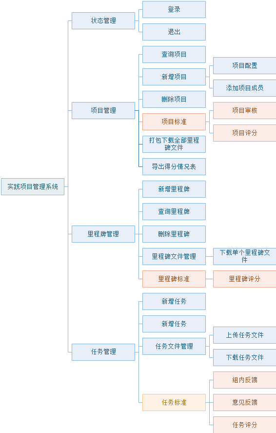

## 实践项目管理信息系统
>  Develop：JUNGA(xujunjia98@163.com) 林钜隆 杨莹莹

## 背景
实践课程项目是学生将理论知识与实际场景结合的业务实践，是学生锻炼业务能力的第一实践。在此过程中，学生与教师不仅在沟通上存在问题，在项目实践过程中还存在任务分配不明确，未能按计划完成开发任务，时间管理弱，项目开发效率低等项目管理上的问题。本系统主要用于项目指导老师和项目组成员查看项目完成进度、分配任务、上传任务工作、查看任务完成进度和教师评价完成情况

## 架构图

## 用例图

## 技术栈 Stack

### 前端 Front-end
- Vue.js
- Vuex
- Vue-router
- Axios
- Element-UI

### 后端 Back-end
- Node.js(Egg)
- egg-mysql 
- Sequelize

### 数据库 Data-base
- MysSQL
